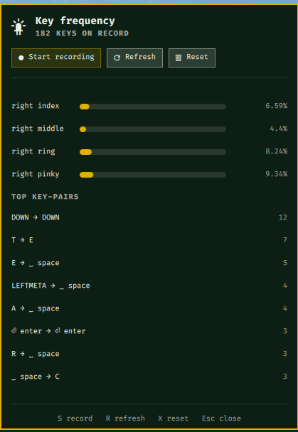

# Omakeylog

An Omarchy bar widget that measures **how often you press each key, each
adjacent key-pair and each short key sequence**, so you can design a better QMK
keymap: what deserves the home row, what to move onto a thumb key or a layer,
which awkward same-finger moves your current layout forces on you, and what
`TAPPING_TERM` suits your home-row mods.

It records **aggregate counts only**, never the text you type.

Listed on the [Omarchy plugin marketplace](https://omarchyplugins.com/plugin.html?id=io.github.cesarfilho.omakeylog).

<p align="center">
  
</p>

## Contents

- [Features](#features)
- [Privacy](#privacy)
- [Requirements](#requirements)
- [Install](#install)
- [Use](#use)
- [Settings](#settings)
- [Reading the analysis](#reading-the-analysis)
- [Your own keyboard layout (Vial)](#your-own-keyboard-layout-vial)
- [From the numbers to a QMK keymap](#from-the-numbers-to-a-qmk-keymap)
- [Engine CLI](#engine-cli)
- [Data files](#data-files)
- [How it works](#how-it-works)
- [Troubleshooting](#troubleshooting)
- [Development](#development)
- [Update](#update)
- [Remove](#remove)
- [License](#license)

## Features

- **Keyboard heatmap**: every key shaded by how often you press it; hover a key
  for its count.
- **Per-key counts** for every key on every keyboard attached, including
  modifiers, arrows, Enter, Backspace and the Super key.
- **Pairs, skip-pairs and triples** (bigrams, skipgrams, trigrams): the raw
  input every layout optimizer works from.
- **Hand balance, finger load and row usage**, from standard QWERTY fingering
  or from **your own Vial keymap**.
- **Same-finger bigrams and skipgrams (SFBs/SFSs)**: the moves your layout makes
  you type with one finger.
- **Trigram patterns**: alternation, rolls, one-hand runs and redirects.
- **Shortcuts** counted separately (`Ctrl+C`, `Super+Enter`), so they don't
  pollute the typing statistics.
- **Home-row-mod timing**: how long you hold keys when tapping, how often you
  roll one key over the next, and a suggested `TAPPING_TERM`.
- **Before and after**: after you change your keymap and reset, the panel
  compares the new recording with the previous one.
- **QMK suggestions** in plain language.
- **Robust recording**: runs as a separate process that survives shell reloads,
  picks up keyboards plugged in later, copes with keyboards being unplugged,
  and resumes after a reboot if it was on.
- **CSV export** for external layout tools (oxeylyzer, genkey and similar).
- **Safe reset**: resetting backs the old counts up instead of deleting them.

## Privacy

A key logger is sensitive software, so here is exactly what this one keeps.

- **Key → number of presses.**
- **Pair → number of times typed back-to-back**, **skip-pair** (two keys with
  one in between) **→ count**, and **triple → count**. Keys only chain when
  each comes within 1.5 seconds of the previous one.
- **Shortcut → count** for keys pressed while Ctrl, Alt or Super is held.
- **Histograms of hold time and roll overlap** in 10 ms buckets, and the
  average hold time per key.

It never keeps the order of your keypresses, never stores a timestamp per key,
never records which window had focus, and never sends anything over the
network.

It only counts **your own typing**:

- **Your seat only.** On a multiseat machine each seat has its own keyboards
  and its own user. The recorder asks logind for its session's seat and opens
  only the keyboards udev assigns to that seat (`ID_SEAT`, `seat0` when
  untagged), including ones plugged in later.
- **Your session only, unlocked.** Once a second it checks that its session is
  the active one on the seat (`Active=yes`) and that the screen is not locked.
  Lock state comes from logind's `LockedHint` and, because Omarchy's lock
  screen and hyprlock don't report it there, from the lockers themselves
  (`omarchy-shell lock isLocked`, a running `hyprlock`). If the lock state
  can't be read (the call fails or times out), the screen counts as locked.
  Keys are held back until the next check and counted only if the session was
  active and unlocked both before and after them, so typing right after a lock
  or user switch is never counted on stale state; the last second before a
  lock may be lost. While another user's session is in front or the screen is
  locked, keys are read and thrown away, so the password you type to unlock
  is never counted, and the panel shows **Paused**.
- **Fails closed.** Without a logind session that has a seat, recording does
  not start; if logind cannot be asked, nothing is counted.

Everything it writes is private to you: the data folder is created `0700` and
every file `0600`, whatever your umask. Files left by version 1.0 are tightened
the next time the engine runs. Totals like "E was pressed 4,812 times" or "T → H → E happened 390
times" cannot be turned back into the passwords or messages you typed.

To be fully transparent: a triple count does carry a little more than a single
key count. If you typed one rare word many times, its three-letter fragments
would be among the counts, mixed in with everything else you typed. They are
still unordered totals and nothing places them in time or in a window. Reset
deletes nothing, it moves the counts to a backup file, so delete those too if
you want them gone (see [Data files](#data-files)).

All data stays in `~/.local/share/omakeylog/` as plain JSON you can open and
read yourself. Recording is **off** until you press **Start**, and the bar icon
lights up whenever it is on.

## Requirements

Omakeylog reads the keyboard through Linux evdev (`/dev/input/event*`), which
needs two things that Omarchy does not set up by default. Do this once:

1. **The evdev Python binding**

   ```bash
   omarchy pkg add python-evdev
   ```

2. **Read access to the keyboard devices**: add your user to the `input`
   group, then **log out and back in** (group changes only apply to new
   sessions).

   ```bash
   sudo usermod -aG input "$USER"
   ```

   Check it took effect after logging back in: `id -nG | grep -w input`.

The engine always runs under the system interpreter `/usr/bin/python3`. That
matters if you use mise, pyenv or asdf: their `python3` comes first on your
`PATH` and would not see the `python-evdev` package from pacman.

Until both steps are done, the panel shows what is missing and how to fix it,
and recording stays off.

## Install

Install it from its [marketplace page](https://omarchyplugins.com/plugin.html?id=io.github.cesarfilho.omakeylog), or:

```bash
omarchy plugin add https://github.com/cesarfilho/omakeylog.git --enable
```

Or by hand: clone this repository into
`~/.config/omarchy/plugins/io.github.cesarfilho.omakeylog/`, then run
`omarchy plugin enable io.github.cesarfilho.omakeylog`.

The widget goes to the right side of the bar. Move it with
`omarchy bar move io.github.cesarfilho.omakeylog --section left`.

## Use

| Action | What it does |
|---|---|
| Left-click the keyboard icon | Open or close the panel |
| Middle-click the keyboard icon | Start or stop recording without opening the panel |
| **Start recording** / **Stop** | Start or stop the background counter |
| **Refresh** | Recompute the analysis now |
| **Reset**, then **Confirm reset** | Back up the current counts and start from zero |

Keyboard shortcuts while the panel is open: `S` start/stop, `R` refresh, `X`
reset, `Esc` close.

The icon is dimmed when nothing has been recorded yet and highlighted while
recording. Hover it for the current total.

Counts accumulate across sessions and reboots. Short samples are skewed by
whatever you happened to be doing (an afternoon of Vim leans heavily on
`J`/`K`; a day of chat leans on Space and Enter), so **record normal work for a
few days** before drawing conclusions.

If recording was on when you logged out or shut down, it starts again on its
own at your next login. Pressing **Stop** turns that off until you press
**Start** again. You can disable resuming entirely in the settings.

## Settings

Change these from the Omarchy settings panel, or in the widget's entry in
`~/.config/omarchy/shell.json`:

| Key | Default | Meaning |
|---|---|---|
| `showLabel` | `false` | Show a number next to the bar icon |
| `labelMode` | `Total` | `Total`: keypresses on record. `Top key`: your most-pressed key |
| `topKeys` | `12` | Keys listed in the panel (5–40) |
| `topBigrams` | `10` | Key-pairs listed in the panel (5–30) |
| `refreshIntervalSec` | `3` | How often the open panel refreshes (1–30 s) |
| `showHeatmap` | `true` | Show the keyboard heatmap |
| `compareWithPrevious` | `true` | Compare with the recording before the last reset |
| `resumeRecording` | `true` | Start recording again after a reboot or logout, if it was on |

When the panel is closed, the widget checks the engine every 8 seconds so the
icon reflects whether recording is on.

## Reading the analysis

The panel shows these sections, top to bottom:

- **Comparison** (only after a reset): the previous recording's same-finger
  bigram rate next to the current one. Finger load rows also show the change in
  percentage points.
- **Heatmap**: your keyboard, each key shaded by its share of presses. Hover a
  key for the exact count. The line under it names the layout used for
  fingering.
- **Most-pressed keys**: your keys ranked by count and share. The top of this
  list is your prime real estate and belongs on the strongest, easiest
  positions: home row, index and middle fingers, thumb keys.
- **Hand balance**: left vs right vs thumbs. Around 50/50 between the hands is
  comfortable; a big skew means one hand is doing the work.
- **Finger load**: share per finger. Pinkies and ring fingers are weak, so a
  pinky above roughly 10% is a classic target for a fix (Backspace, Enter and
  Shift usually cause it).
- **Top key-pairs**: the most common back-to-back pairs in typing.
- **Same-finger bigrams**: pairs typed by one finger twice, such as `E → D` or
  `R → T` on QWERTY. They are slow and tiring, and the main thing an optimized
  layout reduces. Repeats of the same key (`L → L`) are not counted.
- **Same-finger skipgrams**: the same, with one key in between (`E → x → D`).
  Less costly than SFBs, but layout analyzers weigh them too.
- **Trigram patterns**, for every three-key run:
  - *alternate*: hands go left, right, left (or the reverse), which is easy;
  - *roll*: two keys on one hand on different fingers, then the other hand;
  - *one-hand*: three keys on one hand moving steadily inward or outward;
  - *redirect*: three keys on one hand that change direction, which is
    awkward;
  - *same-finger*: the run contains a same-finger pair.
- **Top shortcuts**: key combinations with Ctrl, Alt or Super held. They are
  counted apart from typing, so `Ctrl+C` does not show up as a `CTRL → C` pair.
  Shift is part of typing: a capital letter still counts in the pairs.
- **Timing (home-row mods)**:
  - *median tap* and *95% of taps under*: how long you hold an ordinary
    keypress;
  - *rolled keypresses*: how often you press the next key before releasing the
    previous one;
  - *median roll overlap*: how long the two keys are down together when you
    roll;
  - *suggested TAPPING_TERM*: above nearly all your taps, with a 30 ms margin,
    kept between 150 and 300 ms. It appears after a few hundred keypresses.
- **QMK suggestions**: short, plain-language takeaways from all of the above.

Without a custom layout, fingering assumes standard QWERTY touch typing on a
row-staggered keyboard with Space on the thumbs. Keys outside the main block
(arrows, F-keys) show up in the ranking and the heatmap but not in the finger
or row breakdown.

## Your own keyboard layout (Vial)

On a QMK keyboard, Linux only sees the keycode a key sends, not where the key
is. For finger load, same-finger pairs and the heatmap to reflect your real
board, give Omakeylog your keymap:

1. In Vial, **File → Save current layout** to get a `.vil` file.
2. Import it:

   ```bash
   ~/.config/omarchy/plugins/io.github.cesarfilho.omakeylog/engine/omakeylog layout import-vil ~/my-keyboard.vil
   ```

3. Check the result, which lists the keys for each finger:

   ```bash
   ~/.config/omarchy/plugins/io.github.cesarfilho.omakeylog/engine/omakeylog layout show
   ```

The import assumes a split keyboard as Vial stores it: the left half's rows
first, then the right half's, and the last row of each half is the thumb
cluster. Columns map outer to inner as pinky, ring, middle, index, with any
extra outer column on the pinky and the two innermost on the index. Every
layer is read, so a key that only exists on a layer still gets its finger from
its position. Mod-taps such as `LSFT_T(KC_A)` count as the letter for typing
and place the modifier on the same key.

If the right hand comes out mirrored (index keys listed under the pinky), run
the import again with `--right-inner-first`. For anything the import gets
wrong, edit `~/.config/omakeylog/layout.json` by hand: each key maps to
`[hand, finger, row]`, with hand `L` or `R`, finger `pinky`, `ring`, `middle`,
`index` or `thumb`, and row `3` number, `2` top, `1` home, `0` bottom, `-1`
thumb. `layout reset` goes back to QWERTY.

## From the numbers to a QMK keymap

Some common ways to act on what you see:

- **A frequent key sits off the home row** (Backspace, Enter, a bracket): put
  it on a thumb key, or behind a layer key held by the thumb.
- **A modifier is near the top of the ranking** (Ctrl, Shift, Super): try
  [home-row mods](https://docs.qmk.fm/mod_tap), so `A S D F` double as
  modifiers when held. Start from the suggested `TAPPING_TERM`.
- **Many rolled keypresses**: with home-row mods, rolls are what trigger
  accidental modifiers. QMK's
  [Chordal Hold](https://docs.qmk.fm/tap_hold#chordal-hold) or a longer tapping
  term help.
- **A shortcut ranks high** (`Ctrl+C`, `Ctrl+V`, `Super+Enter`): a combo or a
  shortcut layer saves the reach for the modifier.
- **A pinky carries too much**: move Backspace and Enter to thumbs; Escape can
  go on a tap-dance or a combo.
- **High same-finger rate**: consider an alternative alpha layout (Colemak-DH,
  Graphite, or one generated from your own data). Export the counts with
  `engine/omakeylog report --csv` and feed them to an optimizer.
- **Repeated `BACKSPACE → BACKSPACE`**: a word-delete key (`C(KC_BSPC)`) on a
  layer saves a lot of presses.

Then measure the change: press **Reset** when you flash the new keymap, record
a few days, and the panel shows the new same-finger rate and finger load next
to the old ones.

## Engine CLI

The panel drives a small command-line program you can also run directly. From
the installed plugin folder
(`~/.config/omarchy/plugins/io.github.cesarfilho.omakeylog/`):

```bash
engine/omakeylog record                 # start counting in the background
engine/omakeylog record --foreground    # count in this terminal (Ctrl+C stops)
engine/omakeylog record --device /dev/input/event3   # only this device (repeatable)
engine/omakeylog resume                 # start again only if it was on before
engine/omakeylog stop                   # stop the background counter
engine/omakeylog status                 # JSON: recording, pid, devices, error, totals
engine/omakeylog report                 # readable report with QMK suggestions
engine/omakeylog report --json          # same analysis as JSON (what the panel reads)
engine/omakeylog report --csv           # key,count,percent - for layout optimizers
engine/omakeylog report --no-compare    # leave out the comparison with the last backup
engine/omakeylog reset                  # back up stats.json and start from zero
engine/omakeylog layout show            # which keys each finger types
engine/omakeylog layout import-vil FILE [--right-inner-first]
engine/omakeylog layout reset           # back to the QWERTY mapping
```

Without `--device`, it records every device that has letter keys and a space
bar, so mice, power buttons and lid switches are skipped, and laptop and
external keyboards are counted together. Keyboards plugged in while recording
are picked up within a few seconds, and an unplugged keyboard is simply
dropped. Use `--device` to count only one keyboard; `ls -l /dev/input/by-id/`
shows which `eventN` is which.

## Data files

Counts live in `~/.local/share/omakeylog/`, or under `$XDG_DATA_HOME` if you
set it:

| File | Contents |
|---|---|
| `stats.json` | The raw counts and timing histograms (see [Privacy](#privacy)) |
| `report.json` | The derived analysis the panel displays |
| `status.json` | Whether recording is on or paused, which devices, last error, totals |
| `state.json` | Whether recording should resume at the next login |
| `omakeylog.pid` | Process ID of the running counter (only while recording) |
| `stats.json.YYYYMMDD-HHMMSS.bak` | Backups made by **Reset**; the newest is the comparison baseline |

The custom layout, if you import one, is `~/.config/omakeylog/layout.json`.

Counts are saved every 5 seconds while you type, and once more when recording
stops, so at most a few seconds are lost if the machine loses power. Data from
version 1.0 is read as is; the new statistics start filling in from the first
recording with 1.1.

## How it works

Two parts cooperate:

- **`engine/omakeylog`**: a single-file Python program, no dependencies beyond
  `python-evdev`. It reads key presses and releases from the keyboard devices,
  keeps the tallies in memory, writes them to disk, and computes the analysis.
  It runs as your own user, detached from the shell, so a shell reload or
  `omarchy restart shell` doesn't stop recording.
- **The bar widget** (`BarWidget.qml`, `Panel.qml`, `Model.js`): starts and
  stops the engine, polls its status, and renders `report.json`. The QML only
  displays; all counting and analysis happen in the engine.

No root privileges, system services or network access are involved.

## Troubleshooting

**The panel says "no read access to /dev/input".** You are not in the `input`
group in this session. Run the `usermod` command from
[Requirements](#requirements), then log out and back in; a new terminal is not
enough.

**The panel says "python-evdev is not installed".** Install it with
`omarchy pkg add python-evdev`. If it is already installed, check that the
system interpreter sees it: `/usr/bin/python3 -c 'import evdev'`.

**"No keyboard devices found on seat0".** No device on your seat reported
letter keys and a space bar. List them with `ls -l /dev/input/by-id/` and pass yours explicitly:
`engine/omakeylog record --device /dev/input/eventN`.

**The panel says "Paused".** Your session is not the active one on the seat,
or the screen is locked. Counting continues as soon as you are back. If it stays paused
while you are at your desktop, check `loginctl show-session "$XDG_SESSION_ID" -p Active -p LockedHint`.

**Recording did not resume after a reboot.** It only resumes if it was on when
the session ended and `resumeRecording` is enabled. Press **Start** once and it
will resume from then on.

**The bar shows an old version after updating.** Run `omarchy restart shell`;
the running shell keeps the previous widget in memory.

**Finger load looks wrong on a QMK keyboard.** Import your Vial keymap (see
[Your own keyboard layout](#your-own-keyboard-layout-vial)). Without it, keys
are assigned fingers as on a QWERTY laptop keyboard.

**No suggested TAPPING_TERM.** It needs a few hundred keypresses recorded with
version 1.1 or later; older data has no timing.

## Development

The engine has unit tests for the counting, the analysis, the Vial import and
the recording loop (with simulated keyboards being plugged in and unplugged):

```bash
python3 -B -m unittest discover -s tests -v
.github/scripts/validate.sh             # the checks the marketplace runs
```

GitHub Actions runs both on every push and pull request. Bumping `version` in
`manifest.json` on `main` tags and publishes a release, then opens a
verification request on the plugin marketplace for that exact commit. A
marketplace maintainer approves each update before it replaces the listed
snapshot.

## Update

```bash
omarchy plugin update io.github.cesarfilho.omakeylog
omarchy restart shell
```

Your recorded counts and custom layout are kept across updates.

## Remove

Stop recording first, with the **Stop** button or:

```bash
~/.config/omarchy/plugins/io.github.cesarfilho.omakeylog/engine/omakeylog stop
```

Then remove the plugin:

```bash
omarchy plugin remove io.github.cesarfilho.omakeylog
```

The recorded counts and layout are left in place in case you reinstall. Delete
them with `rm -rf ~/.local/share/omakeylog ~/.config/omakeylog`. If you added
yourself to the `input` group only for Omakeylog, undo it with
`sudo gpasswd -d "$USER" input` and log out and back in.

## License

[MIT](LICENSE) © cesarfilho
